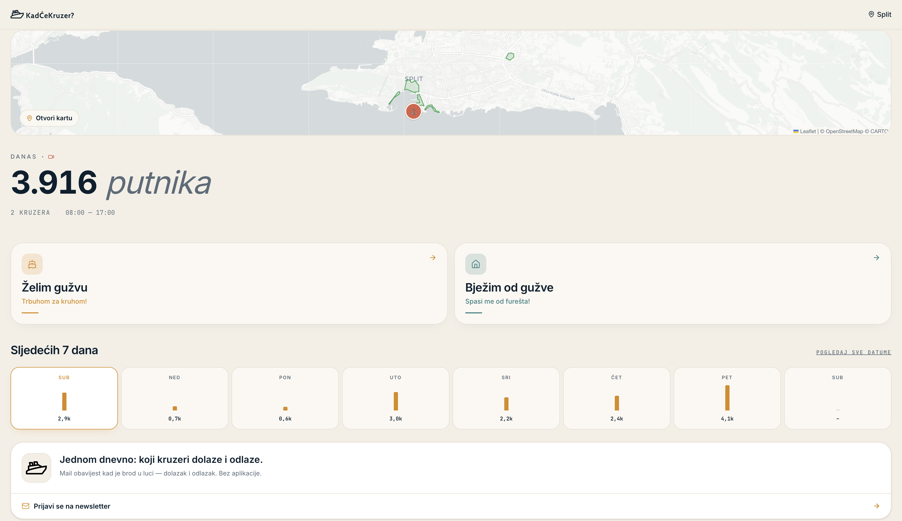

# KadĆeKruzer?



> Split drowns under cruise crowds. KadĆeKruzer? forecasts per-zone surges in 30-min slots, then flips the lens: locals find calm windows to run errands; tuk-tuks and shops spot peak hours to cash in. Same data, opposite playbooks.

**Video walkthrough:** <https://www.youtube.com/watch?v=A0Cu6grWr70>

---

## The problem

A single cruiser can drop 3–5k passengers on Split in a couple of hours. On peak days the city sees 10k+ disembarking — choking the Old Town, the ferry port, the Riva, and (when it rains) Mall of Split.

Existing tools tell you _that_ a ship is coming. They don't tell you _what to do about it_ — and the answer depends entirely on whether the crowd helps you or hurts you.

## The solution

One forecast, two opposite UIs:

| Route                  | For who                                         | Headline question                       |
| ---------------------- | ----------------------------------------------- | --------------------------------------- |
| `/zelim-guzvu`         | Tuk-tuk drivers, restaurants, shop owners, port vendors | _When and where will the crowd be?_ |
| `/bjezim-od-guzve`     | Locals trying to live their life                | _When and where can I dodge it?_     |
| `/map`                 | Anyone                                          | _Show me the city right now._           |

Both persona pages share the same hero number, day toggle (Danas / Sutra), 7-day outlook, and zone chips — only the accent colour, advice copy, and which windows get ranked first change. Cohesion by design.

---

## How it works

```
 cruisetimetables.com           Open-Meteo (free)
        │                              │
        ▼                              ▼
 ┌──────────────────────────────────────────┐
 │  Node pipeline  (scripts/)               │
 │   • scrape-cruises.ts                    │
 │   • generate-forecast.ts                 │
 │   • sync-static.ts                       │
 └──────────────────────────────────────────┘
        │
        ▼  JSON contracts (cruises, zones, forecast)
 ┌──────────────────────────────────────────┐
 │  Static Next.js 16 frontend              │
 │   • persona engine (lib/persona.ts)      │
 │   • Leaflet map                          │
 │   • Resend newsletter                    │
 └──────────────────────────────────────────┘
```

### Allocation model — not ML

A transparent, conservation-true heuristic lives in [`scripts/lib/heuristic.ts`](./scripts/lib/heuristic.ts). At every 30-min slot:

```
ashore_from_ship(t)  = capacity × 0.75 × disembarkation_curve(t)
raw_share(z)         = BASE_SHARE[z] × WEATHER_MODIFIER[zone_type][bucket]
load(z, t)           = Σ_ships ashore_from_ship(t) × normalised_share(z)
```

Every constant is anchored to published cruise-tourism / climate-tourism research (CLIA, Castillo-Manzano 2018, Stefanidaki & Lekakou 2014, Croatian Bureau of Statistics). See [`data/README.md`](./data/README.md) for the full write-up.

The output is mapped to four intensity levels (`green / yellow / orange / red`) via per-zone passenger-density thresholds (pax/ha).

### Persona engine

[`lib/persona.ts`](./lib/persona.ts) is a small, pure-function library that scans the slot grid and produces ranked `DisplayWindow`s — busy / calm / danger — tailored to the active persona. It handles:

- **Window merging** — identical windows across zones collapse into a single card.
- **Real-clock filtering** — windows ending in <30 min are hidden so you never see stale advice.
- **Ship-state detection** — `allShipsDepartedForDay`, `lastDepartureForDay`, `firstArrivalForDay` drive the hero's state machine ("Stigli su ljudi." → "Kupci su otišli u 17:00 · sutra opet od 08:00.").
- **Croatian-correct pluralisation** — `pluralizeHr` handles singular / paucal / genitive plural.

---

## Tech stack

| Layer          | Choice                                                       |
| -------------- | ------------------------------------------------------------ |
| Framework      | Next.js 16.2 (App Router, Turbopack), React 19.2             |
| Styling        | Tailwind v4, custom palette in `app/globals.css`             |
| Map            | Leaflet 1.9 + react-leaflet 5 (dynamic-imported, `ssr:false`) |
| Charts         | Recharts                                                     |
| Icons          | lucide-react                                                 |
| Pipeline       | TypeScript on Node 20, cheerio for HTML, native `fetch`      |
| Weather        | [Open-Meteo](https://open-meteo.com) (free, no key)          |
| Cruise source  | [cruisetimetables.com](https://www.cruisetimetables.com/split-croatia-cruise-ship-schedule-2026.html) |
| Newsletter     | Resend Contacts (`/api/newsletter`)                          |
| Linting / TS   | ESLint 9, TypeScript 5                                       |

---

## Quick start

The repository ships with pre-built forecast JSON in `public/data/`, so you can run the UI without ever touching the pipeline.

```bash
git clone https://github.com/martinmlcoch/sheepai-front.git
cd sheepai-front
npm install
npm run dev
```

Then open <http://localhost:3000>.

### Refreshing the data

```bash
cd scripts
npm install
npm run build:data    # scrape + sync + forecast → writes data/ + public/data/
```

Individual stages:

| Command              | What it does                                                    |
| -------------------- | --------------------------------------------------------------- |
| `npm run scrape`     | Pulls 2026 cruise timetable → `data/cruises.json`               |
| `npm run forecast`   | Joins cruises + Open-Meteo, runs the model → `data/forecast.json` |
| `npm run sync`       | Mirrors `data/*.json` → `public/data/*.json`                    |
| `npm run zones:export` | Exports zone polygons to `data/zones.geojson` (edit in geojson.io) |
| `npm run zones:import` | Reads back the edited geojson → `data/zones.json`            |

---

## Project structure

```
sheepai-front/
├── app/                          # Next.js App Router
│   ├── page.tsx                  # Home (hero + crowd chart + 7-day outlook + newsletter)
│   ├── map/page.tsx              # Leaflet map + time slider
│   ├── zelim-guzvu/page.tsx      # "I want the crowd" persona
│   ├── bjezim-od-guzve/page.tsx  # "I escape the crowd" persona
│   ├── calendar/page.tsx         # ICS subscription (stub)
│   ├── api/newsletter/route.ts   # Resend Contacts handler
│   └── globals.css               # Tailwind theme + Leaflet overrides
│
├── components/
│   ├── persona/                  # Shared persona UI (Hero, DayToggle, ZoneChips,
│   │                             # WindowCard, WeekOutlook, EmptyState, PageClient)
│   ├── map/                      # MapView, MapHeader, TimeSlider
│   └── …                         # Home, Navbar, CrowdChart, etc.
│
├── lib/
│   ├── forecast.ts               # Data types + fetch helpers + level colours
│   ├── persona.ts                # Window aggregation, merging, ship-state, pluralisation
│   ├── copy.ts                   # All Croatian UI strings (single source of truth)
│   └── format.ts                 # Croatian number formatting
│
├── data/                         # Canonical JSON (single source of truth)
│   ├── cruises.json
│   ├── zones.json
│   ├── forecast.json
│   └── README.md                 # Full data contract + model documentation
│
├── public/data/                  # Mirror of data/ for static serving
│
└── scripts/                      # Standalone Node pipeline (separate package.json)
    ├── scrape-cruises.ts
    ├── generate-forecast.ts
    ├── sync-static.ts
    ├── zones-{import,export}-geojson.ts
    └── lib/heuristic.ts          # The allocation model
```

---

## Design principles

The frontend follows the rules in [`CLAUDE.md`](./CLAUDE.md):

- **Mobile-first** — iPhone 14 (390px) is the design target.
- **Numbers are heroes** — every passenger count, time, percentage is tabular and bigger than the surrounding text.
- **Croatian first** — every UI string lives in `lib/copy.ts`; English follows.
- **Whitespace > ornament** — no gradients, no glassmorphism, no shadows heavier than `shadow-sm`.
- **Two fonts only** — Fraunces (display) + Inter (everything else), via `next/font`.

---

## Roadmap

Everything visible works end-to-end. The forecast updates nightly rather than live, and the model still uses literature defaults instead of Split-specific calibration. What we'd build next:

- **ICS calendar feed** — subscribe once in Outlook / Google / Apple Calendar and cruise-day reminders flow in forever. Route is stubbed at `/calendar`.
- **Smarter scraping** — handle real-time delays / cancellations, pull from multiple sources for redundancy.
- **Crowd-sourced ground truth** — let users report "the model says calm but Pjaca is packed" so per-zone constants can be recalibrated from real signal.
- **AI advice layer** — the persona library already produces a clean windows API; an LLM "what should I do at 15:00 if I'm a tuk-tuk driver?" layer can sit on top without restructuring.
- **Multi-city** — same model should generalise to Dubrovnik, Zadar, Kotor.

---

## Built at

Split Hackathon 2026. Demo-quality, but the architecture (separate Node pipeline, static JSON contracts, pure-function persona engine) is built to outlive the hackathon.

The product-facing name is **KadĆeKruzer?** (_"When's the cruiser?"_). The repo / package name (`sheepai-front`) is a hackathon-team legacy and may be renamed.
